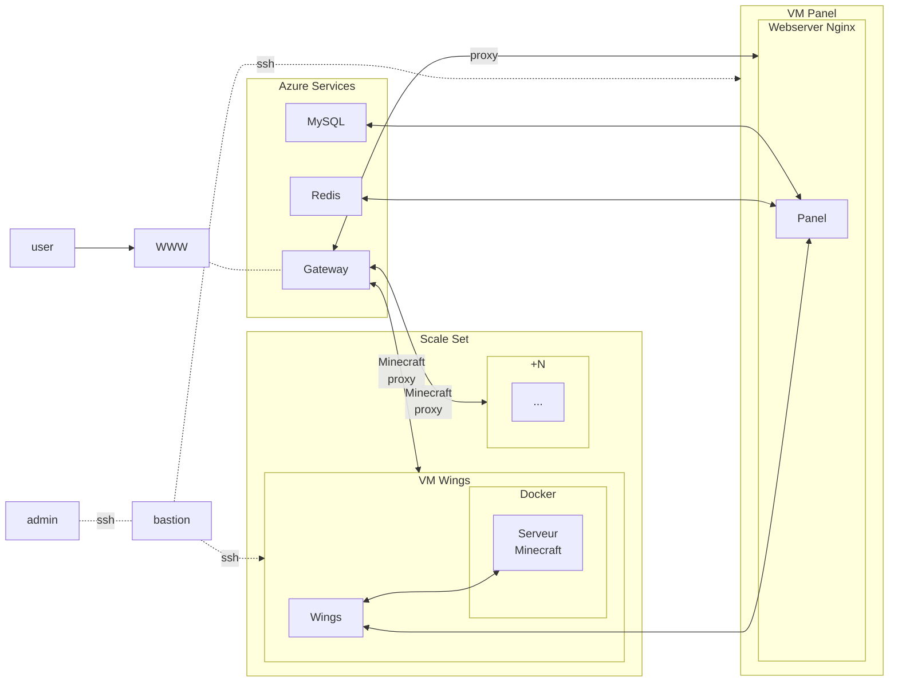

# Plan déploiment pterodactyl - Brief 4 - Groupe 2

FAQ Pterodactyl : [Lexique Pterodactyl](https://pterodactyl.io/project/terms.html)

Web server : nginx
OS : debian 11
Déploiment via ansible

## une topologie de l’infrastructure,

## la liste des ressources Azure,
#### 1 ressource groupe
#### 1 machine panel :
- nginx + panel pterodactyl
- 1 VM Standard_B1ls
     - 1 vcpu
     - 0,5 Gio
- Debian 11 - changé pour Ubuntu 20.04
- 1 FQDN
     
#### n machine(s) (scaling set) node
- wings (pterodactyl)
- docker + egg minecraft (image docker)
- 1 VM Standard B2s
    - 2 vcpu
    - 4 Gio
- Debian 11 - changé pour Ubuntu 20.04

#### 1 VM bastion
 - 1 VM Standard_B1ls
     - 1 vcpu
     - 0,5 Gio
- Debian 11 - changé pour Ubuntu 20.04
#### 1 database mysql azur
#### 1 (database) redis azur
#### 1 Vnet avec 2 subnet
#### 2 IPs publiques
#### 1 gateway
#### 1 key vault
#### Azure monitor
#### 1 azure backup

## la liste des tâches à faire,

- Préparation du projet (topologie, liste des ressources...)
- Déploiment d'une infra basique
    - 1 resource group
    - Vnet, Subnets, 
    - 1 ip publique, 3 VM Linux + connexion SSH et test commande
- Déploiement BDD (MySQL et Redis)
- Implémenter un script cloud-init
    - VM Panel
        - désintaller Apache
        - installer NginX
        - vérifier que PHP (+extentions: cli, openssl, gd, mysql, PDO, mbstring, tokenizer, bcmath, xml or dom, curl, zip, and fpm), curl, tar, unzip, git et composer v2 sont installées 
        - Sinon, les installer
        - installer le panel
    - VM Wings
        - installer curl
        - installer docker
        - installer wings
        - start wings
        - deamoniser wings
    - installer VM de rebond
- Déploiement application gateway
- TLS
    - Avec Azure key vault et compte de stockage public
    - Création d'un conteneur
    - Règle de redirection sur l'App Gateway
    - Test URL
    - Implémentation de script / [challenge http-01](https://letsencrypt.org/docs/challenge-types/)
    - Vérification
- Monitoring
- Test de montée en charge (script)
- Backup stockage / BDD
- Scale set
- Auto scale

## la stratégie de scaling,
La stratégie de scaling consistera à déployer une nouvelle VM Wings ou Node quand la mémoire vive utilisée sera supérieure à la RAM libre.

## les tests et métriques de monitoring,

La métrique choisie est la charge CPU, la stratégie à mettre en place est un scale out si CPU > 70%, sacle in si CPU < 25%

## le plan de test de charge,
Le test de charge consistera a charger dans un "monde" minecraft des entités non joueur en grande quantité.

## la politique de backup.
sauvegarder le "world" mineraft toutes les heures.
___
 
 
___

# Ce que nous avons fait :

- Etablissement du plan d'action
- Installation d'ansible sur nos machines linux
- lecture de documentation

Pour le déploiement nous avons choisi d'utiliser Ansible.

## Fonctionnement d'Ansible :

Ansible est un moteur d'automatisation qui permet, dans notre cas, d'effectuer des déploiements vers Azure en passant par des modules. 
Ces modules sont appelés dans des fichiers "playbooks", permettant de définir les services et ressources à déployer ainsi que leurs paramètres.

---
Puis rédaction de playbooks pour déployer l'infra prévue

1 playbook "main", appellant tous les autres playbooks dans l'ordre logique de déploiement :
- [L'infra de base](https://github.com/Simplon-AlainCaupin/Simplon-Groupe2brief4/blob/main/PreDroProd/PedroInfra.yml)
Contenant le "resource group", Vnet, subnet, public IPs, NICs et NSGs nécessaires

- [Une ressource BDD Azure MySQL](https://github.com/Simplon-AlainCaupin/Simplon-Groupe2brief4/blob/main/PreDroProd/BDDcache.yml)
Avec une règle firewall autorisant l'IP publique de la machine hôte
(IP à changer manuellement dans le playbook)

- [Une première VM de rebond (vm bastion)](https://github.com/Simplon-AlainCaupin/Simplon-Groupe2brief4/blob/main/PreDroProd/PedroBastion.yml)
Pour limiter les coûts, une image très limitée en ressources a été choisie
[Un fichier Cloud-init](https://github.com/Simplon-AlainCaupin/Simplon-Groupe2brief4/blob/main/PreDroProd/initBastion) a été créé en parallèle pour créer les groupes et utilisateurs admins

- [Déploiement des "end points" en prévision de l'application gateway](https://github.com/Simplon-AlainCaupin/Simplon-Groupe2brief4/blob/main/PreDroProd/pedroendpoint.yml)

- [Déploiement d'une VM "panel", ayant pour but d'héberger un conteneur comprenant une serevur nginx et l'un des composants de l'application Pterodactyl](https://github.com/Simplon-AlainCaupin/Simplon-Groupe2brief4/blob/main/PreDroProd/PedroPanel.yml)
Un [second fichier "cloud init"](https://github.com/Simplon-AlainCaupin/Simplon-Groupe2brief4/blob/main/PreDroProd/initPanel) est utilisé pour déployer le container contenant "panel" dans la vm, + la création d'un fichier de configuration nécessaire à l'installation

- [Création d'un storageShare SMB](https://github.com/Simplon-AlainCaupin/Simplon-Groupe2brief4/blob/main/pedroShare.yml) Pour permettre de la création d'un fichier de configuration pour le container instance de panel. Le fichier de configuration aurait été créé à la création du bastion avec cloudinit pour ensuite être utilisé par le panel.

- [Mise en place de l'application gateway Azure](https://github.com/Simplon-AlainCaupin/Simplon-Groupe2brief4/blob/main/PreDroProd/appedrogatway.yml)

Test de déploiement via le "main" playbook, après nombre de tests et corrections, les ressources sont déployées et "fonctionnelles".

Difficultés rencontrées face à la stratégie à adopter pour l'application Pterodactyl :

Dans un premier temps le choix de la ressource à utiliser pour lier le subnet de l'appli à l'end-point du container. La première idée était d'utiliser un load-balancer, finalement nous avons opté pour une application gateway mais qui nous pose également soucis sur les ports, le choix restant serait un NAT gateway, plus logique pour notre utilisation (rediriger le traffic vers 1 container dans une vm)

Beaucoup de temps passé à essayer de faire fonctionner des scripts cloud-init via 1 playbook ansible, beaucoup d'échecs.

La solution a été de changer d'OS pour la VM.
Debian 10/latest stable dans un premier temps, Ubuntu 20.04 dans un second temps. Suite à quoi les fichiers cloud-init se sont bien déroulés et on permis d'installer une partie de l'appli (Panel) dans le container prévu à cet effet.

Nous avons aussi eu des difficultés en essayant de déployer le panel pterodactyl dans un container instance de azure qui ne permet pas d'avoir une IP privée et qui nous permet de connaitre uniquement l'adresse ip du container en entrée mais pas en sortie. Notre déploiment d'un endpoint pour la base de données mysql s'est avérée inutile sans adresse ip privée sur le container.

___

# Scale set (terraform)

l'installation de terraform nous a semblé bien plus évidente, et nous a pris beaucoup moins de temps.

une fois terraform installé nous avons pu nous familiariser avec le déploiement d'infra depuis ce dernier pour enfin pouvoir s'atteler au scale set.

Pour ce dernier nous avons commencé par lire la documentation de terraform afin de le déployer sur azure.

Nous avons remplacé la vm par un scale set (vmss) avec les règles de scale out et scale in puis nous avons configuré le monitoring et l'application gateway pour ce dernier.

Après avoir développé un script de montée en charge, nous avons pu tester et vérifier la règle mise en place (scaling à +70% de charge CPU) et vérifier les alertes mails, qui ont bien été reçues.

Ensuite mise en place du scale in à 25% de charge CPU, les tests sont concluants.
